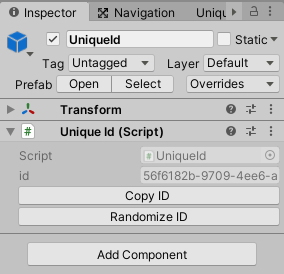

# Fluid Unique ID

Unique ID management for Unity3D projects. A customizable micro-framework for managing consistent unique IDs across multiple scenes on your GameObjects. Built with large projects in mind and tools to prevent ID conflicts. 

* Works with prefabs
* Visual repair tool included
* No coding required
* Easily extendable
* Heavily tested with TDD and unit tests

**Support**

Join the [Discord Community](https://discord.gg/8QHFfzn) if you have questions or need help.

## Quickstart

To get started [install](#installation) the package and update it to the latest version. After that simply open a scene and attach the UniqueId component to your desired GameObject. These components are automatically prefab friendly with no extra overhead.



But what if you duplicate this object with the unique ID? It would no longer be unique and things might go haywire when users play. We'll talk about how to fix that in your game next.

### Repair Window

Fluid Unique ID includes a repair window that will scan all of your scene's GameObjects for errors like duplication or `null` values. You can find the repair window in your menu bar at `Window -> Fluid -> Unique ID Repair`.


Please note when clicking search that the repair window uses your current **Project Window** selection. Also it is recommended to not edit scenes until you've addressed all repair window errors. As search takes a snapshot of all scenes and can't detect if you're changing the scene without another search.

### Examples

Clone this project down and see the examples folder to take things for a spin with live code samples.

## Guides

### How To Check For Unique IDs Before Building

The best way to make sure your project doesn't have Unique ID errors before building is to write a simple test. We'll use Unity's internal testing framework with a Unique ID report search. Please note this must be placed in an `Editor` folder to work.

```c#
public class ExampleVerifyIdTest {
    [Test]
    public void It_should_not_have_invalid_IDs_in_the_project () {
        var reporter = new UniqueIdReporter("Assets/Examples");
        var report = reporter.GetReport();

        Assert.AreEqual(0, report.ErrorCount);
    }
}
```

Note that you can have build systems like Unity Cloud Build or custom build pipelines run tests automatically. This way you never accidentally check in a broken ID.

### How To Populate Runtime Instances

If you need an ID for runtime instance from a prefab you can call the `UniqueId.PopulateIdIfEmpty()` method since prefabs automatically wipe their ID. This method is recommended to prevent accidentally rewriting a Unique ID.

```c#
var id = GameObject.Instantiate(myPrefab).GetComponent(UniqueId);
id.PopulateIdIfEmpty();
```

If you are spawning instances off of a pre-existing instance with an ID. You can scramble it with the following pattern. Note this is potentially destructive so be careful.

```c#
var id = GameObject.Instantiate(myPrefab).GetComponent(UniqueId);
id.ScrambleId();
```

## Installation

Fluid Unique ID is used through [Unity's Package Manager](https://docs.unity3d.com/Manual/CustomPackages.html). In order to use it you'll need to add the following lines to your `Packages/manifest.json` file. After that you'll be able to visually control what specific version of Fluid Unique ID you're using from the package manager window in Unity. This has to be done so your Unity editor can connect to NPM's package registry.

```json
{
  "scopedRegistries": [
    {
      "name": "NPM",
      "url": "https://registry.npmjs.org",
      "scopes": [
        "com.fluid"
      ]
    }
  ],
  "dependencies": {
    "com.fluid.unique-id": "1.0.1"
  }
}
```

## Releases

Archives of specific versions and release notes are available on the [releases page](https://github.com/ashblue/fluid-unique-id/releases).

## Nightly Builds

To access nightly builds of the `develop` branch that are package manager friendly, you'll need to manually edit your `Packages/manifest.json` as so. 

```json
{
    "dependencies": {
      "com.fluid.unique-id": "https://github.com/ashblue/fluid-unique-id.git#nightly"
    }
}
```

Note that to get a newer nightly build you must delete this line and any related lock data in the manifest, let Unity rebuild, then add it back. As Unity locks the commit hash for Git urls as packages.

## Development Environment

If you wish to run to run the development environment you'll need to install the latest [node.js](https://nodejs.org/en/). Then run the following from the root once.

`npm install`

If you wish to create a build run `npm run build` from the root and it will populate the `dist` folder.

### Making Commits

All commits should be made using [Commitizen](https://github.com/commitizen/cz-cli) (which is automatically installed when running `npm install`). Commits are automatically compiled to version numbers on release so this is very important. PRs that don't have Commitizen based commits will be rejected.

To make a commit type the following into a terminal from the root

```bash
npm run commit
```

---

This project was generated with [Oyster Package Generator](https://github.com/ashblue/oyster-package-generator).
